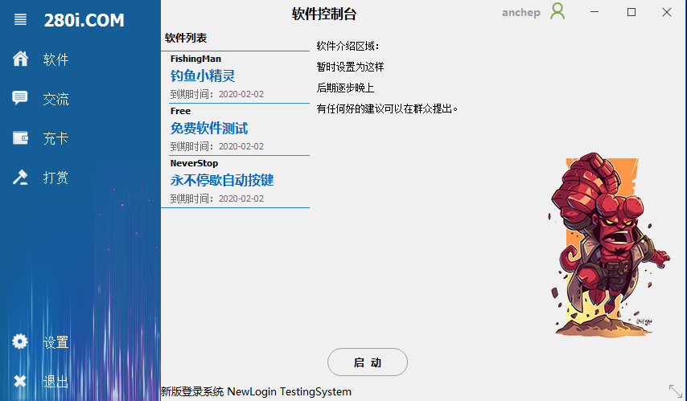

# 软件控制台 280i-Login

我们先来看看软件主界面截图：

最新版本下载地址：[https://www.280i.com/ann/8048.html](https://www.280i.com/ann/8048.html)

###### 界面简易介绍：

​	左上角点击后会自动缩放或者展开菜单栏

​	设置中可以设置软件的 【自动更新】【自动登录】【最小化程序】【迷你菜单】

​	鼠标放置在账号位置可以显示账户VIP时间，点击即可注册/找回密码

​	账户右侧菜单中可【更新软件】【获取时间】【打开日志】

###### 软件运行规则：

​	直接双击软件，或者选择对应软件后点击启动

​	若运行的软件不存在，软件会自动下载对应软件后启动

###### VIP规则：

​	本站VIP使用统一VIP，充卡后即可享有对应的VIP软件使用权

