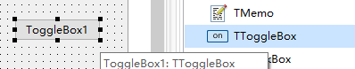

# TToggleBox 滑动开关

> 此控件Delphi中有对应的，这里的默认显示效果不如Delphi中的显示效果，需要微调

1. ##### 添加控件

   

2. ##### 控件属性

   

3. ##### 控件效果

   

4. ##### 示例代码：

   1. ```pascal
      if ToggleBox1.checked then
      begin
      	//这里是要执行的任务
      end;
      ```

      

5. 