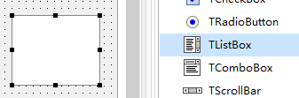

TListBox 列表

列表主要逐行显示，可以选择

1. 添加控件

   

2. 设置内容

   

3. 运行效果

   

4. 示例代码

   1. ```pascal
      procedure TForm1.Button1Click(Sender: TObject);
      begin
        ListBox1.Items.Add('增加项');
      end;
      
      procedure TForm1.Button2Click(Sender: TObject);
      begin
         Form1.Caption := ListBox1.Items[ListBox1.ItemIndex];
         //ListBox1.Items[n] ,n代表编号，从0开始
        // ListBox1.ItemIndex 代表当前选中的项的编号
      end;
      ```

      

5. 补充