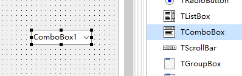
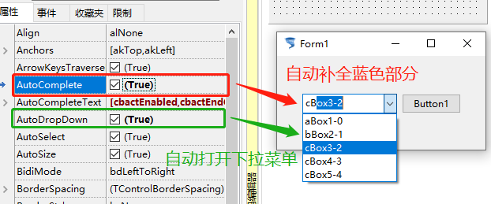

ComboBox 组合框（也是就下拉框）

下拉框日常中用的比较多，主要记住调用下拉框选项的方法

1. 添加控件

   

2. 控件属性

   

   

3. 运行效果（自动补全；自动下拉）

   

   

4. 示例代码

   1. ```pascal
      procedure TForm1.Button1Click(Sender: TObject);
      begin
        Form1.Caption:= ComboBox1.Items[ComboBox1.ItemIndex];//这里的用法和ListBox是一样的
      end; 
      ```

      

5. 补充