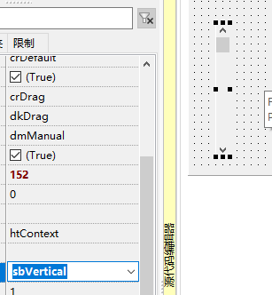
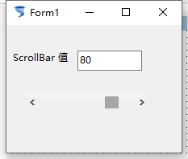

# TScrollBar 滚动条

> 老式滚动条，用处还是不少的。

1. 添加控件

   

2. 控件属性

   

   

3. 运行效果

   

4. 示例代码

   1. ```pascal
      procedure TForm1.ScrollBar1Change(Sender: TObject);
      begin
        Edit1.Text:= ScrollBar1.Position.ToString;
      end; 
      ```

      

5. 补充