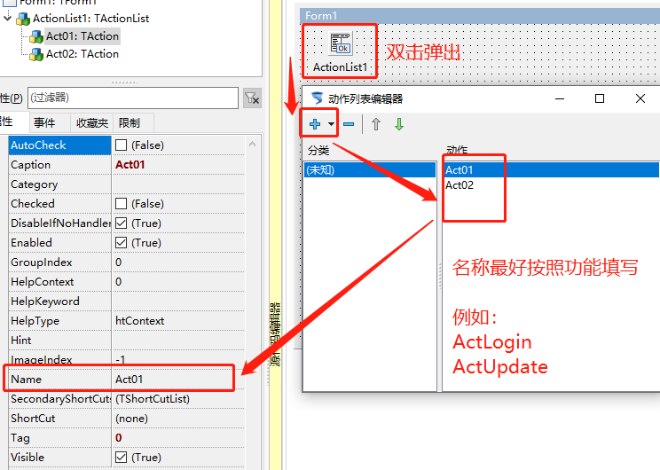
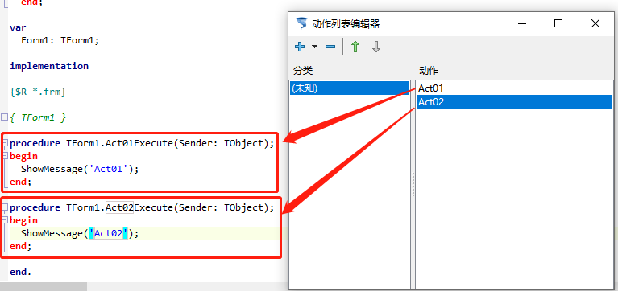

# TActionList 动作列表

> 此控件为开发过程中使用频率比较高的控件，常用的一些操作可以写在 ActionList里面，那里需要执行对应的代码只需要在控件的Action里面选择ActionList中的Action即可。
>
> 此控件和第一个以及第二个控件一样，属于不可视的控件。

1. ##### 添加控件

   1. 
   2. 

2. ##### 设置属性

   1. 
   2. 
   3. 

3. ##### 运行效果

   1. 
   2. 

4. ##### 示例代码

   1. ```pascal
      procedure TForm1.Act01Execute(Sender: TObject);
      begin
        ShowMessage('Act01');
      end;
      
      procedure TForm1.Act02Execute(Sender: TObject);
      begin
        ShowMessage('Act02');
      end; 
      ```

      

5. ##### 补充