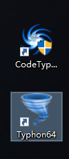

# CodeTyphon安装流程

1.首先来确认下载

官方下载地址 ： https://www.pilotlogic.com/sitejoom/index.php/downloads.html

本站共享下载地址：
共享地址:http://u.280i.com/index.php?share/file&user=1&sid=4fVgQ96R 提取密码:2f1Ng、

2.解压压缩包到任意目录，（不要包含中文目录）

3.右键管理云模式运行 install.bat

由于我这里已经安装，就不截图了，首先 0 安装，会提示安装DirectX ，按照要求安装，记得去掉DirectX上的一个广告选项

接下来 1 安装，这个时候就会安装管理器。

由于我的管理器已经安装好 IDE，因此项目比较多，请勿着急，接下来才是真正的安装步骤

4.安装IDE环境，我们这里选择全部安装 （ bigIDE）

这里选择完整编译安装，如果需要32位的支持，可以安装32位的版本

此为编译过程。

由于软件需要编译后安装，因此对于机器的CPU要求比较高，我的机器较老，有点慢

5.编译安装完成后，桌面会生成对应的快捷方式，打开即可。也可以通过 CodeTyphon Center进入

第一个为软件中心，第二个就是我们的主角 Typhon