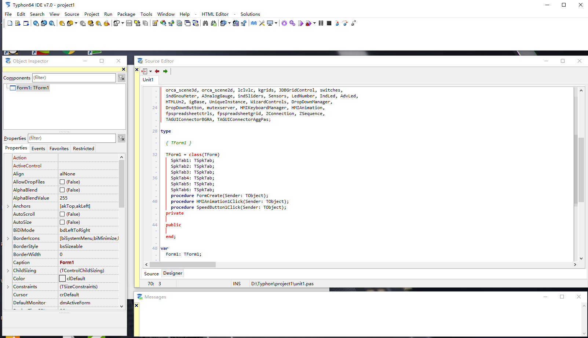
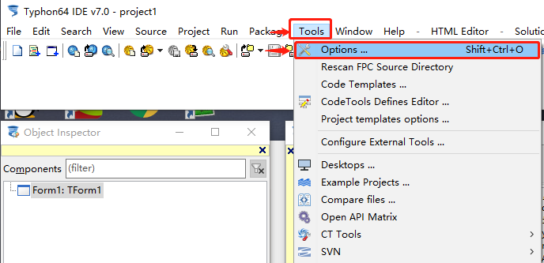
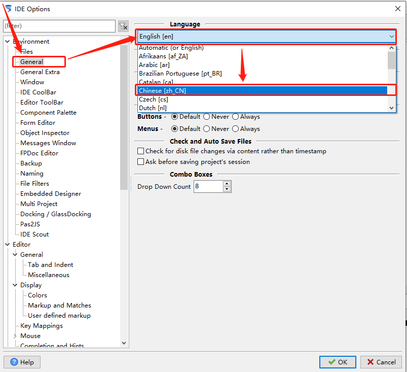
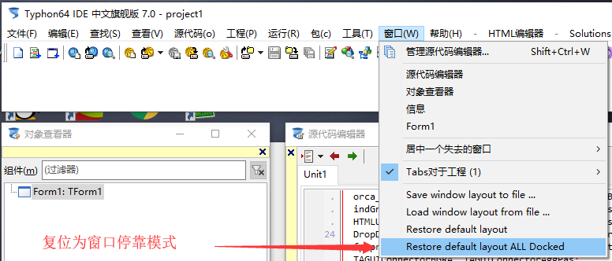
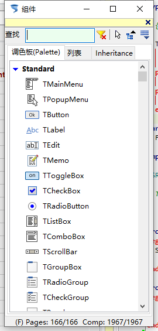
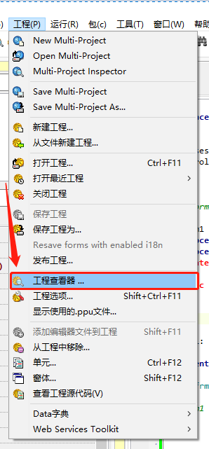
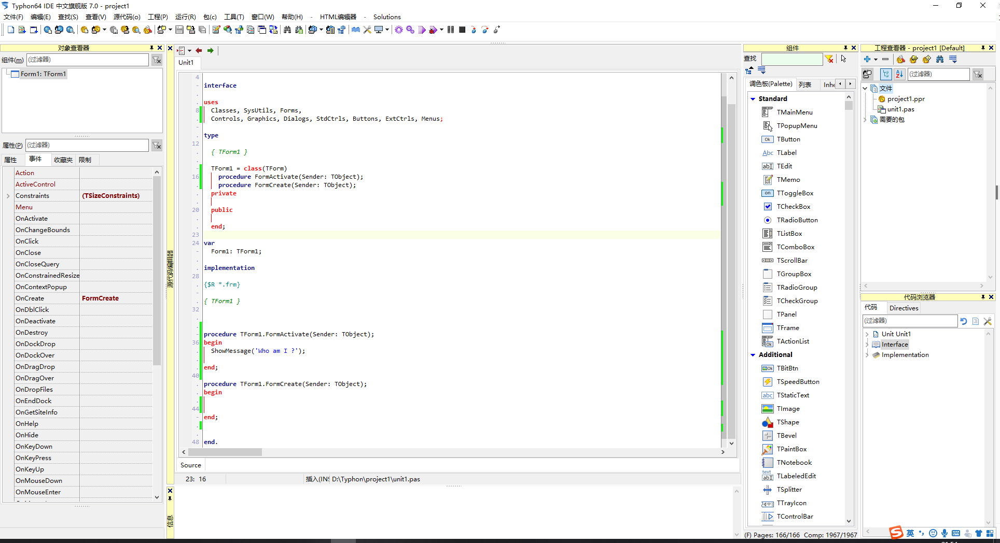
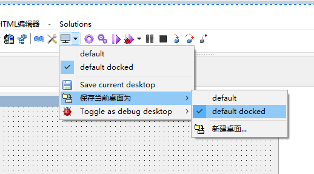

# 界面配置

默认界面是分离模式，和Delphi7的默认格式一样

这个就是我们看到的默认界面

### 1.设置语言：

Tools - Options 

General - Language - Chinese [zh_CN] --【OK】-- 重启IDE ，然后就能得到一个中文的IDE，虽然部分界面仍是英文，但是也不影响日常的使用工作。

### 2.设置窗口停靠

窗口 - Restore default layout ALL Docked

这里窗口就整合到一起了。

### 3.添加对应窗体

这里添加两个： 代码浏览器  和 组件

弹出的窗口拖拽黄色部门即可停靠，拖动标题栏是无法停靠的

调出工程查看器

依旧拖拽黄色部分停靠

最终这就是我们停靠后的截图效果。具体的还可以修改字体已经代码编辑区域的颜色等信息，这些均在设置中

配置完成还有一件事情，就是要保存窗体布局

default : 默认窗体布局
default docked: 默认窗体停靠布局