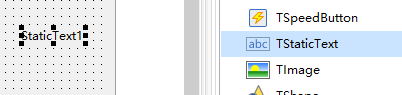
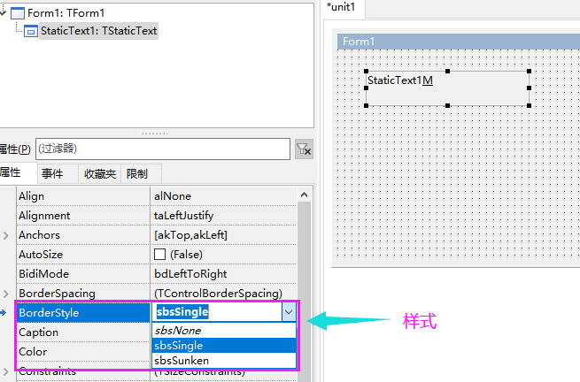

# TStaticText

> 可设置 BorderStyle 属性来改变样式
>
> TStaticText 可以打开 TabStop竖向，让控件支持Tab停靠
>
> 与label相比，TStaticText无 WordWrap（自动换行）

#### 添加控件

#### 属性简介

ShowAccelChar 属性打开的情况下，在Caption中有 &M，就可以使用Alt+M快捷键。

然后在FocusControl 中选择需要激活的控件，按上面的快捷键，选择的控件即获得焦点。