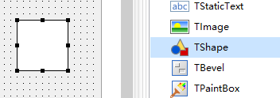
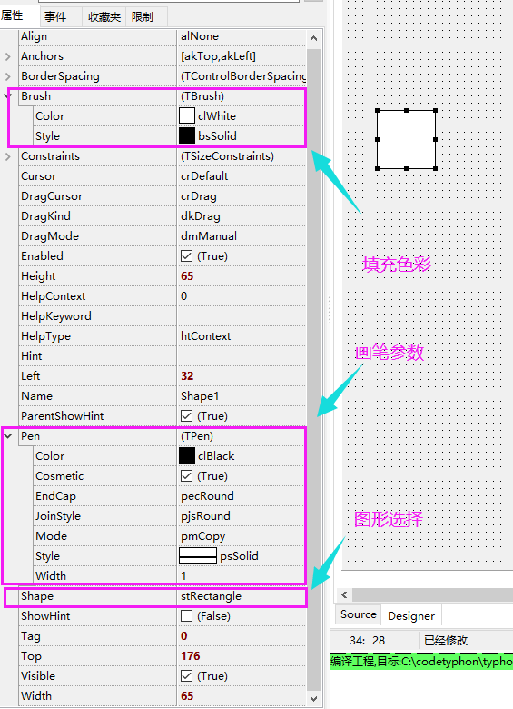

TShape图形控件

> 这个控件就是一个图形控件,直接从TGraphicControl继承下来,然后重载Paint方法就可以了,因为也没有其他好做的了.

##### 几个点：

1. Brush	
   1. -Color背景色	
   2. -Style填充样式
2. Pen
   1. Color：边框色
   2. Cosmetic：美化
   3. EndCap：边线为点的时候的模式
   4. JoinStyle
   5. Mode:模式
   6. Style:线条模式
   7. Width：线条宽度
3. Shape 形状

##### 添加控件

##### 属性介绍

