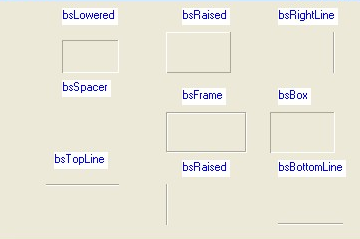

# TBevel组件

该组件可以创建具有3D效果的斜角的盒子、方框或线。

##### 常用属性：

　　shape：设置边界形状

　　style：设置分解的框线在屏幕上是凸起还是凹下。

　　shape属性

　　**type** TBevelShape = (bsBox, bsFrame, bsTopLine, bsBottomLine, bsLeftLine, bsRightLine, bsSpacer);

　　bsBox: 由style属性决定。

　　bsFrame：客户区域是凸起还是凹下。

　　bsTopLine：Bevel对象在客户区域显示一条线

　　bsBouttonLine：Bevel对象在客户区域的底部显示一条线。

　　bsLeftLine：Bevel对象在客户区域的左边显示一条线。

　　bsRightLine：Bevel对象在客户区域的右边显示一条线。

　　bsSpacer：Bevel对象是空的空间。

 

##### Tbevel组件方法

　　BringToFront：将组件放置在其父组件内所有其他组件的前面

　　ClientToparent：使用该方法将一个当前组件坐标系统的Point点转换为Aparent的坐标系统响应的点

　　ClientToScreen：使用该方法可将一个组件本地坐标表示的点转换为与屏幕坐标相应的点

　　Create：　　　　创建一个TBevel实例　　

　　DefaultHandler： 提供消息处理的记录

　　Destroy：　　　　销毁TBevel组件的实例

　　Dock：　　　　　 该方法用于内部停靠组件

　　DragDrop：　　  产生OnDragDrop事件

　　Dragging:　　　　使用该方法可确定组件的拖动状态，如果返回True，则表示正在拖放组件，否则表示没有拖放

　　EndDrag：　　　　结束拖动操作。