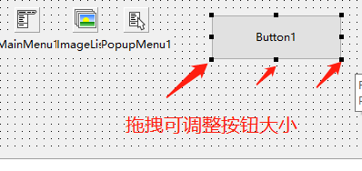
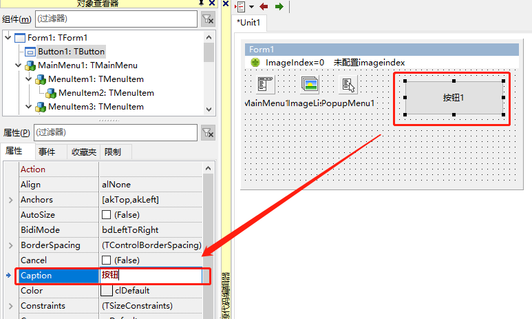
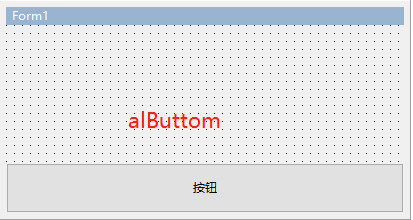
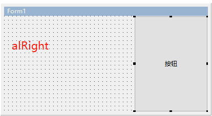
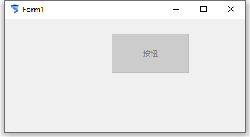
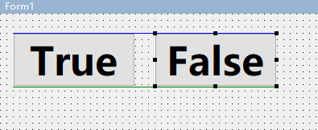

# TButton 按钮

1. ##### 添加Button控件到窗口

   

2. ##### 调整按钮大小

   

3. ##### Caption 修改按钮名称

   

4. ##### Align 对齐：

   1. Align=alButtom

      

   2. Align=alClient

      

   3. Align=alCustom

      

   4. Align=alLeft

      

   5. Align=alNone(默认)

      

   6. Align=alRight

      

   7. Align=alTop

      

5. ##### AutoSize 自动大小

   

   ​	`选择AutoSize后，按钮会根据俺就中文字的长度和高度来自适应按钮的长度和高度`

6. ##### Cursor 光标形状

   ​	此处截图比较麻烦，设置为 crHandPoint ，鼠标移动到按钮上就会显示为手的形状

7. ##### Enable 可用/禁用

   

   ​	显示效果：

8. ##### Font 字体

   1. 设置方式：
   2. 设置效果：

9. ##### Hint 提示信息 ShowHint

   1. 设置提示信息：
   2. 设置效果：

10. ##### Left & Top 左 和 上

    左和上用来确定按钮位置

11. ##### Height & Width 高度 和 宽度

    高度和宽度确定按钮大小

12. ##### Name 名字

    1. 控件的名字，日常命令操作的时候使用的就是这个名字

    2. 将按钮的Name 设置为 BtnMain ，然后在命令行中调用

    3. 命令：

       ```pascal
       BtnMain.Caption := '按钮名字';  
       ```

    4. 效果：

       

13. ##### Visible 可见性

    1. 设置为True ：按钮可以看到
    2. 设置为False：按钮无法看到
    3. IDE界面：
    4. 运行效果：

