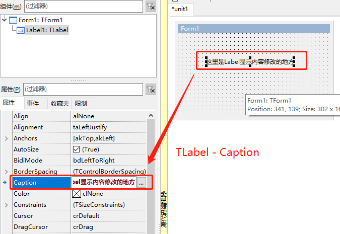

# TLabel 标签

日常使用中，主要用来可视化标注

1. ##### 控件

   

2. ##### 修改Caption 来修改显示内容

   

3. ##### 其他日常操作

   1. 修改字体 Font
   2. 修改鼠标类型 Cursot
   3. 修改自动大小 AutoSize
   4. 修改文字在空间中的对齐方式：Layout ： 【alBottom】底部对齐【alCenter】中间对齐【alTop】顶部对齐
   5. 修改提示信息 Hint &ShowHint
   6. 是否显示 VIsible ，一般在命令中修改
   7. FocusControl:此参数为默认焦点，根据Label中的Caption中的热键属性来确定激活哪个控件

4. ##### 示例代码

   1. ```pascal
      Label1.caption := 'Label1显示的内容';
      Label1.Font.Height := 120; //其他内容也可以这样修改，输入.后稍等下，会出现此控件对应的方法和属性以及事件。
      ```
   2. ```pascal
      Label1.caption := 'Label1显示的内容(&M)';
      Label1.FocusControl := Edit2;//这里执行完成后，只需要点击 Alt + M 就可以将焦点移动到Edit2这个控件中。
      ```

5. 