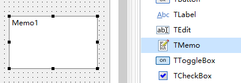
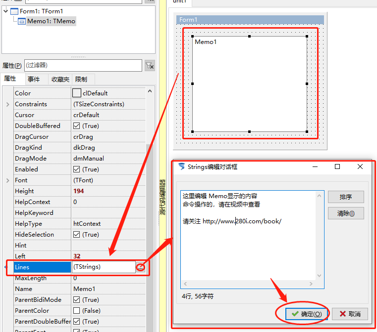
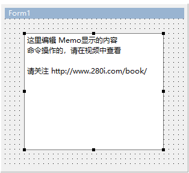

# TMemo 便签

> 此类控件，主要用于大量文字的简易显示，Word那种类型的文字在另外一个控件中，后面会讲到。

1. ##### 插入控件

   

2. ##### 编辑内容

   

3. ##### 显示效果

   

4. ##### 补充

   Memo1.Lines.Append('字符串'); 在Memo最后一行加上一行指定文本
   Memo1.Lies.Delete(10); 删除第11行
   Memo1.Lines.Insert(1,'新一行'); 在第2行插入新行
   Memo1.Alignment 指定段落的对齐方式
   Memo1.Modified Boolean类型,文本是否被修改
   Memo1.WantReturns Boolean类型，当回车时是否输入一个回车符，如不为否，则当事件处理
   Memo1.WantTabs 同上
   Memo1.ScrollBars 选择滚动条，ssNone[无]，ssHorizontal[只有水平],ssVertical[只有垂直]，ssBoth[同时有水平和垂直]