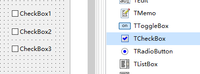
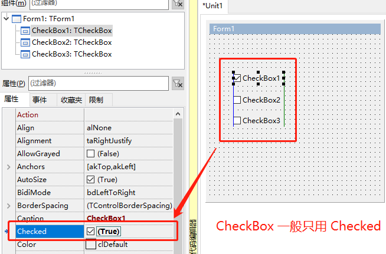
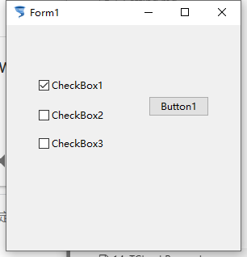

# TCheckBox 选择框（多选框）

> 这里的选择框是多选框，也就是日常碰到的正方形的选择框，可以多选

1. ##### 添加控件

   

2. ##### 控件属性

   

3. ##### 显示效果

   

4. ##### 示例代码

   1. ```pascal
      procedure TForm1.Button1Click(Sender: TObject);
      begin
        if CheckBox1.Checked then
        begin
          CheckBox2.Checked:=True;
          CheckBox3.Checked:= not CheckBox3.Checked;
        end
        else
        begin
          CheckBox2.Checked:= False;
        end;
      end;  
      ```

      

5. 补充

