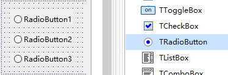
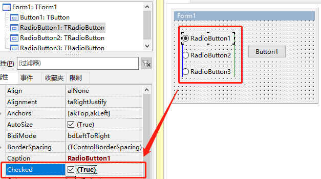
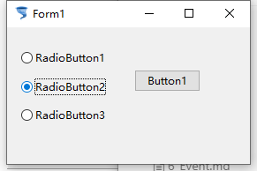

# TRadioButton 单选按钮

> 单选按钮顾名思义只能选择一个，但是如果需要2个以上的时候可以使用CheckBox。

> 如果是几组单选则可以使用后面的控件TRadioGroup，这样每个组里面只能存在一个Checked。

1. ##### 添加控件

   

2. ##### 控件属性（和ToggleBox，CheckBox 一样，重点是checked属性）

   

3. ##### 控件效果

   

4. ##### 示例代码

   1. ```pascal
      procedure TForm1.Button1Click(Sender: TObject);
      begin
        if RadioButton2.Checked then
        begin
          Form1.Caption := ' RadioButton2.checked';
        end
        else
        begin
           Form1.Caption := ' RadioButton2.unchecked';
        end;
      end;  
      ```

      

5. 

