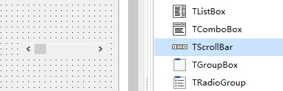
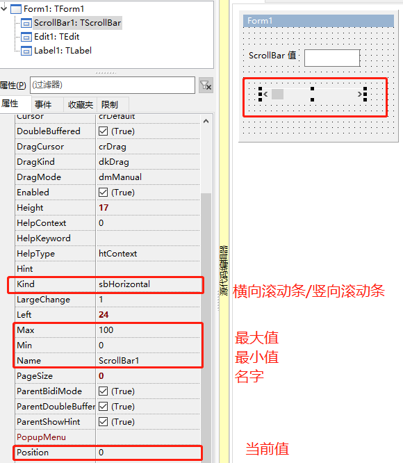

# TScrollBar 滚动条

> 老式滚动条，用处还是不少的。

1. 添加控件

   

2. 控件属性

   

   

3. 运行效果

   

4. 示例代码

   1. ```pascal
      procedure TForm1.ScrollBar1Change(Sender: TObject);
      begin
        Edit1.Text:= ScrollBar1.Position.ToString;
      end; 
      ```

      

5. 补充


一下内容转载自：https://www.cnblogs.com/guorongtao/p/11880391.html

DELPHI的滚动条默认发送消息格式：

function TControl.Perform(
Msg: Cardinal;
WParam: WPARAM;
LParam: LPARAM
): LRESULT;
如：Memo1.Perform(WM_HSCROLL, SB_LEFT, 0);

 

**水平滚动条** 消息 WM_HSCROLL
SendMessage(Memo1.Handle, WM_HSCROLL, MAKEWPARAM(SB_THUMBPOSITION, 50), 0); //滚动至此
SendMessage(Memo1.Handle, WM_HSCROLL, SB_LEFT, 0); //左边缘
SendMessage(Memo1.Handle, WM_HSCROLL, SB_RIGHT, 0); //右边缘
SendMessage(Memo1.Handle, WM_HSCROLL, SB_PAGELEFT, 0); //向左翻页
SendMessage(Memo1.Handle, WM_HSCROLL, SB_PAGERIGHT, 0); //向右翻页
SendMessage(Memo1.Handle, WM_HSCROLL, SB_LINELEFT, 0); //向左滚动
SendMessage(Memo1.Handle, WM_HSCROLL, SB_LINERIGHT, 0); //向右滚动

**垂直滚动条** 消息 WM_VSCROLL
SendMessage(Memo1.Handle, WM_VSCROLL, MAKEWPARAM(SB_THUMBPOSITION, 50), 0); //滚动至此 50为位置 滚动到指定行号
SendMessage(Memo1.Handle, WM_VSCROLL, SB_TOP, 0); //顶部
SendMessage(Memo1.Handle, WM_VSCROLL, SB_BOTTOM, 0); //底部
SendMessage(Memo1.Handle, WM_VSCROLL, SB_PAGEUP, 0); //向上翻页
SendMessage(Memo1.Handle, WM_VSCROLL, SB_PAGEDOWN, 0); //向下翻页
SendMessage(Memo1.Handle, WM_VSCROLL, SB_LINEUP, 0); //向上滚动
SendMessage(Memo1.Handle, WM_VSCROLL, SB_LINEDOWN, 0); //向下滚动

//获得滚动条的位置
The GetScrollPos function retrieves the current position of the scroll box (thumb) in the specified
scroll bar. The current position is a relative value that depends on the current scrolling range.
For example, if the scrolling range is 0 through 100 and the scroll box is in the middle of the
bar, the current position is 50.

{GetScrollPos函数检索指定滚动条中滚动框（拇指）的当前位置。当前位置是一个相对值，取决于当前滚动范围。
例如，如果滚动范围为0到100，并且滚动框位于条的中间，则当前位置为50。}

int GetScrollPos(
HWND hWnd,
int nBar
);
var
h, v: Integer;
begin
h := GetScrollPos(Memo1.Handle, SB_HORZ);
v := GetScrollPos(Memo1.Handle, SB_VERT);
Caption := Format('水平数值=%d 垂直数值=%d', [h, v]);
end;

//显示和隐藏滚动条
ShowScrollBar(Memo1.Handle,SB_HORZ,false); //隐藏MEMO水平滚动条
ShowScrollBar(Memo1.Handle,SB_VERT,false); //隐藏MEMO垂直滚动条

//判断 滚动条是否出现
procedure TForm1.Button1Click(Sender: TObject);
begin
 if (GetWindowlong(Memo1.Handle, GWL_STYLE) and WS_VSCROLL) > 0 then ShowMessage('垂直滚动条显示');
 if (GetWindowlong(Memo1.Handle, GWL_STYLE) and WS_HSCROLL) > 0 then ShowMessage('水平滚动条显示');
end;

