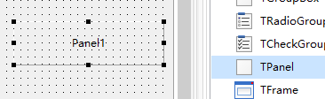

# TPanel 面板

> 窗口布局的最重要控件，日后UI大神的必会控件

1. ##### 添加控件

   

2. ##### 属性设置

   

3. ##### 运行效果

   

4. ##### 示例代码

   1. ```pascal
      //Align 也可以使用代码直接编辑
      Panel1.Align := alLeft;
      Panel2.Align := alClient;
      Panel3.Align := alBottom;
      ```

      

5. ##### 补充