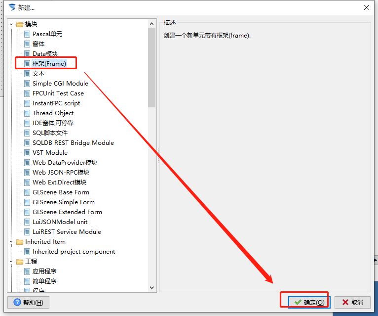
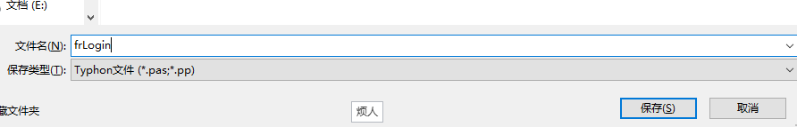
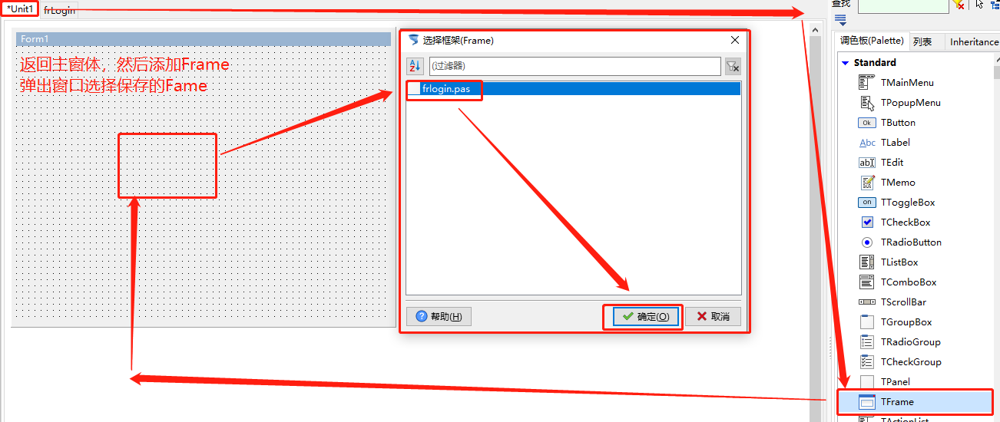
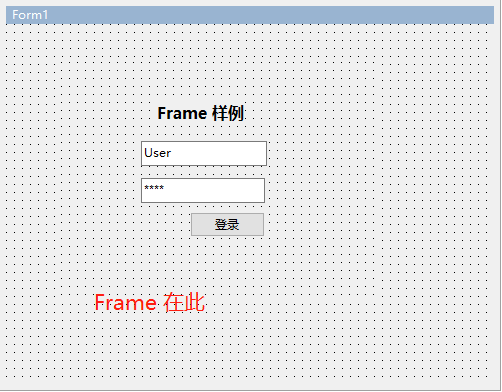
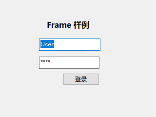

# TFrame 框架

> 框架是很多新人很困惑的地方，放在窗体上有没有什么作用，其实是误解了Frame的用处，Frame是用来预制一个窗体的布局，后面可以快速调用，这样很方便。

1. ##### 新建Frame

   1. 

   2. 

   3. 

   4. 

      ​	这里自动修改为小写了

   5. 

   6. 

2. ##### 属性设置（Frame的属性，不用修改）

3. ##### 运行效果

   

4. ##### 示例代码

5. ##### 补充