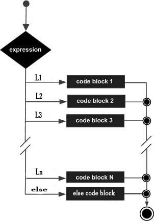

# Case of 语句

### Case of 语法

```pascal
case(expression) of
   L1 : S1;
   L2: S2;
   ...
   ...
   Ln:Sn;
end;
```

L1-Ln 可以使用 整数 字符 布尔 枚举 这几种类型

case语句必须有一个**end**语句与之关联。

#### 流程图


#### 官方样例

```pascal
program checkCase;
var
   grade:char;
begin
   grade :='A';
   case(grade) of
      'A': writeln('Excellent!');
      'B','C': writeln('Well done');
      'D': writeln('You passed');
      'F': writeln('Better try again');
   end;     
   writeln('Your grade is  ', grade );
end.
```

##### 运行结果

```pascal
Excellent!
Your grade is A
```

### Case of else 语句 

```pascal
case(expression) of
   L1 : S1;
   L2 : S2;
   ...
   ...
   Ln:Sn;
else
   Sm;
end;
```

#### 流程图



##### 官方样例

```pascal
program checkCase;
var
   grade:char;
begin
   grade :='F';
   case(grade) of
      'A': writeln('Excellent!');
 
      'B','C': writeln('Well done');
      'D': writeln('You passed');
   else
      writeln('You really did not study right!');
    end;     
   writeln('Your grade is  ', grade );
end.
```

##### 运行结果

```pascal
You really did not study right!
Your grade is F
```

### Case of else 嵌套语句

嵌套语句由于比较复杂，不适合新手教学，所以不多做解释，需要看的可以查看下面的连接

https://www.pilotlogic.com/sitejoom/index.php/wiki/105-wiki/pascal-basics/chapter-2/133-pascal-nested-case-statements.html