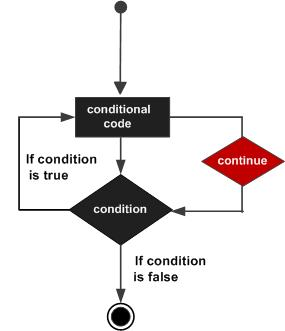

# Continue语句

Continue;

用于从for、while、repeat语句中结束循环内的本次处理,继续从循环体的开始位置继续执行

#### 流程图



#### 官方样例

```pascal
program exContinue; 
var
   a: integer;
begin
   a :=10;
   (* repeat until loop execution *)
   repeat
      if( a =15)then
      begin
         (* skip the iteration *)
         a := a +1;
         continue;
      end;
      writeln('value of a: ', a);
      a := a+1;
   until( a =20);
end.
```

#### 运行结果

```pascal
value of a: 10
value of a: 11
value of a: 12
value of a: 13
value of a: 14
value of a: 16
value of a: 17
value of a: 18
value of a: 19
```

Repeat 语句加入第二期的代码部分学习，本期只用来测试 Continue

