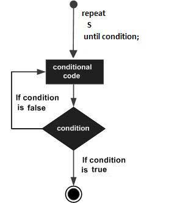

# Repeat循环

语法

```pascal
repeat
   sum := sum + number;
   number := number -2;
until number =0;
```

流程图



官方样例

```pascal
program repeatUntilLoop;
var
   a: integer;
begin
   a :=10;
   // repeat until loop execution //
   repeat
      writeln('value of a: ', a);
      a := a +1
   until a = 20;
end.
```

运行结果

```pascal
value of a: 10
value of a: 11
value of a: 12
value of a: 13
value of a: 14
value of a: 15
value of a: 16
value of a: 17
value of a: 18
value of a: 19
```

