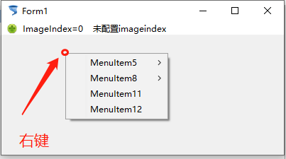

# TPopupMenu 弹出菜单

> ​	右键菜单，常用菜单，日常开发中使用频率很高。

1. ##### 添加控件

   

2. ##### 双击控件，配置菜单

   

3. ##### 配置弹出菜单响应位置：

   

   >   选择Form1，在PopupMenu属性中，下拉选择新添加的 PopupMenu1

4. ##### 【F9】 运行程序，在窗体上右键查看效果

   

5. 